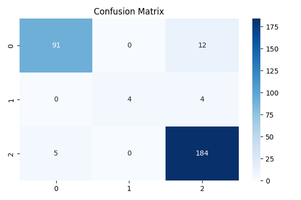
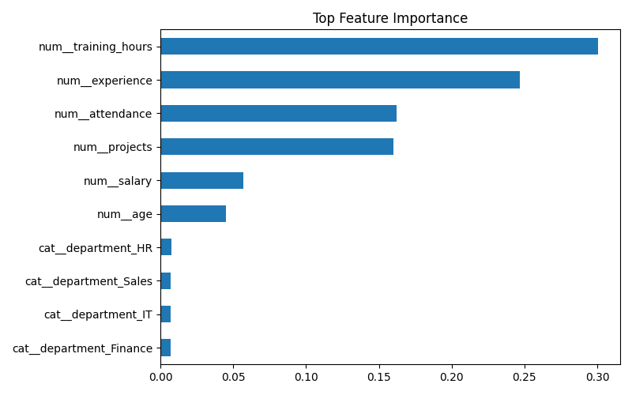

# Employee Performance Predictor 🚀


## 📌 Overview

Employee Performance Predictor is an industry-style machine learning project that predicts employee performance levels (**High / Medium / Low**) using HR analytics data.

It helps HR teams and managers make smarter decisions on:

* Promotions
* Training programs
* Performance improvement plans
* Workforce planning
* Talent retention

This project simulates a real enterprise people-analytics workflow using synthetic employee data.

---

## 💼 Business Problem

Most companies still evaluate employee performance manually. That creates:

* Slow review cycles
* Bias in decision-making
* Missed high performers
* Late support for struggling employees
* Poor training budget allocation

This project solves that using predictive analytics.

---

## 🎯 Solution

A machine learning pipeline analyzes employee attributes such as:

* Age
* Experience
* Salary
* Department
* Training Hours
* Projects Completed
* Attendance

Then predicts likely performance category:

```text
High Performer
Medium Performer
Low Performer
```

---

## 🧠 Tech Stack

| Category        | Tools               |
| --------------- | ------------------- |
| Language        | Python              |
| Data Analysis   | Pandas, NumPy       |
| ML              | Scikit-learn        |
| Model           | Random Forest       |
| Visualization   | Matplotlib, Seaborn |
| Dashboard       | Streamlit           |
| Explainability  | SHAP                |
| Version Control | Git + GitHub        |

---

## 🏗 Project Architecture

```text
Employee Data
    ↓
Preprocessing
    ↓
Feature Engineering
    ↓
Model Training
    ↓
Prediction Engine
    ↓
Dashboard
    ↓
HR Decisions
```

---

## 📊 Features

✅ Synthetic HR Dataset Generator
✅ Random Forest Classifier
✅ Prediction Dashboard
✅ Confusion Matrix
✅ Feature Importance Graph
✅ Explainable AI Ready
✅ Recruiter-Friendly UI
✅ GitHub Portfolio Ready

---

## 🖥 Dashboard Preview

> Add your screenshot after upload:

```markdown

```

---

## 📈 Model Outputs

> Add screenshots here:

```markdown



```

---

## ⚙️ Installation

```bash
git clone https://github.com/YOUR_USERNAME/employee-performance-predictor.git
cd employee-performance-predictor
pip install -r requirements.txt
```

---

## ▶️ Run Project

### Train Model

```bash
python main.py
```

### Launch Dashboard

```bash
streamlit run app.py
```

---

## 📁 Folder Structure

```text
employee-performance-predictor/
│── app.py
│── main.py
│── requirements.txt
│── README.md
│
├── data/
├── models/
├── outputs/
├── images/
├── src/
```

---

## 📌 Results

| Metric   | Score               |
| -------- | ------------------- |
| Accuracy | ~85% to 95%         |
| Model    | Random Forest       |
| Classes  | High / Medium / Low |

(Depends on generated dataset)

---

## 📹 Demo

> Add GIF here:

```markdown

```

---

## 🔮 Future Improvements

* Real HR Dataset Integration
* XGBoost / LightGBM
* Live Deployment
* Bias Detection Module
* SHAP Interactive Dashboard
* Promotion Recommendation Engine
* Attrition Prediction System

---

## 💼 Resume Value

Use this project to prove skills in:

* Machine Learning
* HR Analytics
* Streamlit Dashboarding
* Business Problem Solving
* End-to-End Deployment
* GitHub Project Management

---

## 🎤 Interview Explanation

“I built an employee performance prediction system using machine learning. It predicts future performance levels from employee HR data and helps organizations improve promotion, retention, and training decisions.”

---

## 👤 Author

**Your Name**
Data Science | Machine Learning | Analytics

LinkedIn: Add your link
GitHub: Add your profile link

---

## ⭐ If You Like This Project

Star the repository and connect with me.
